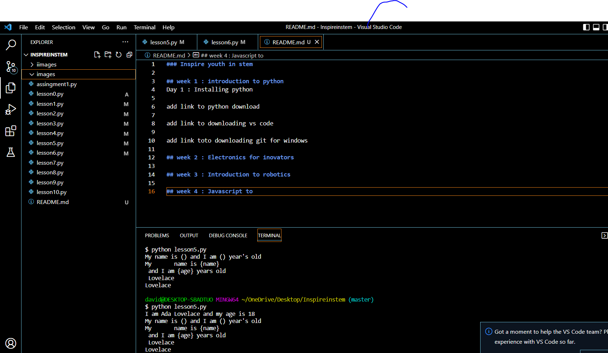
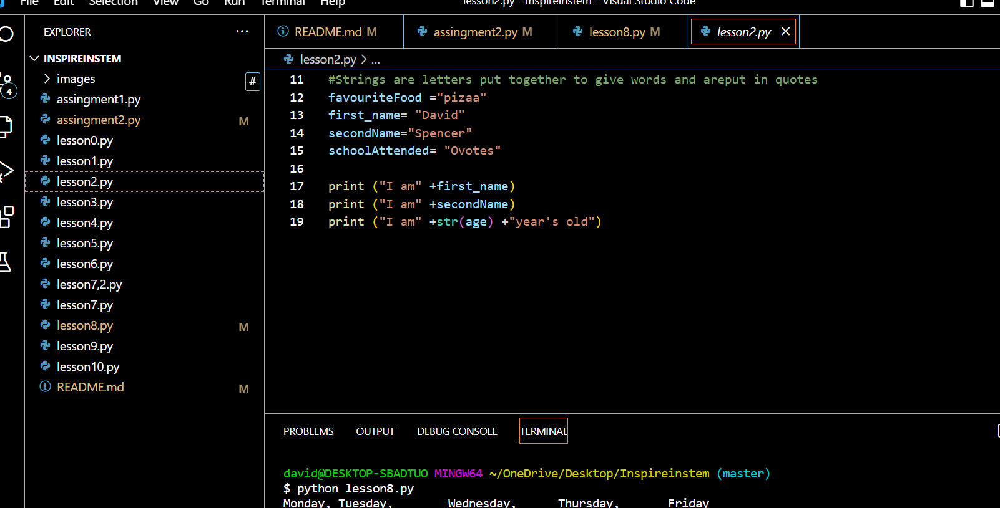
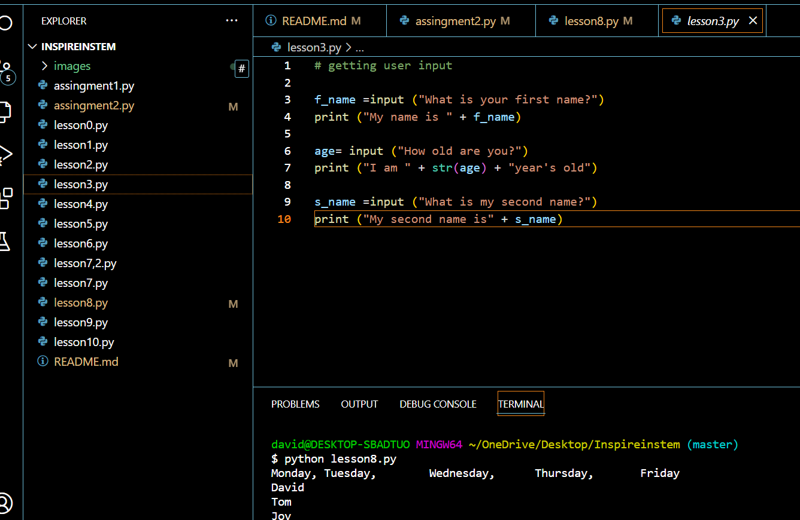
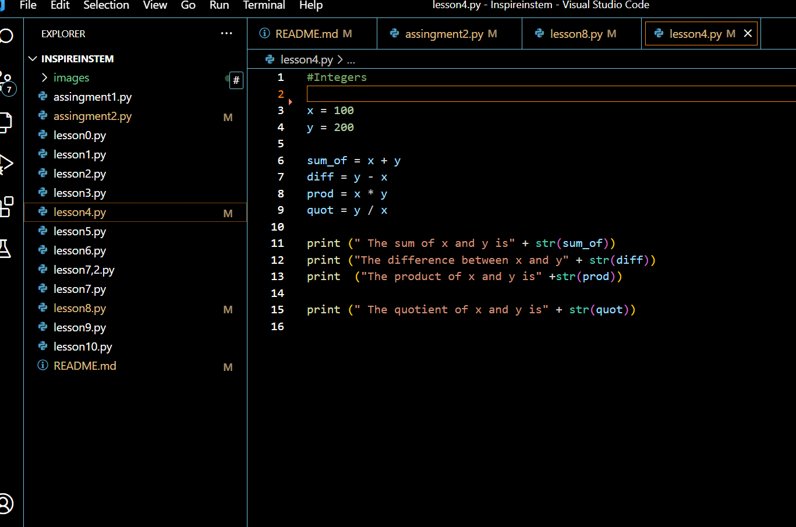
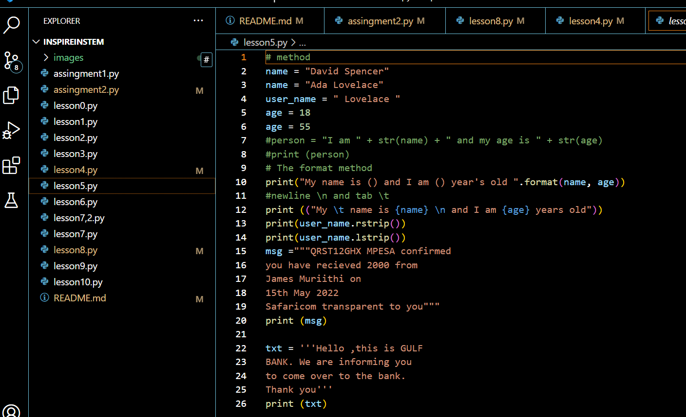
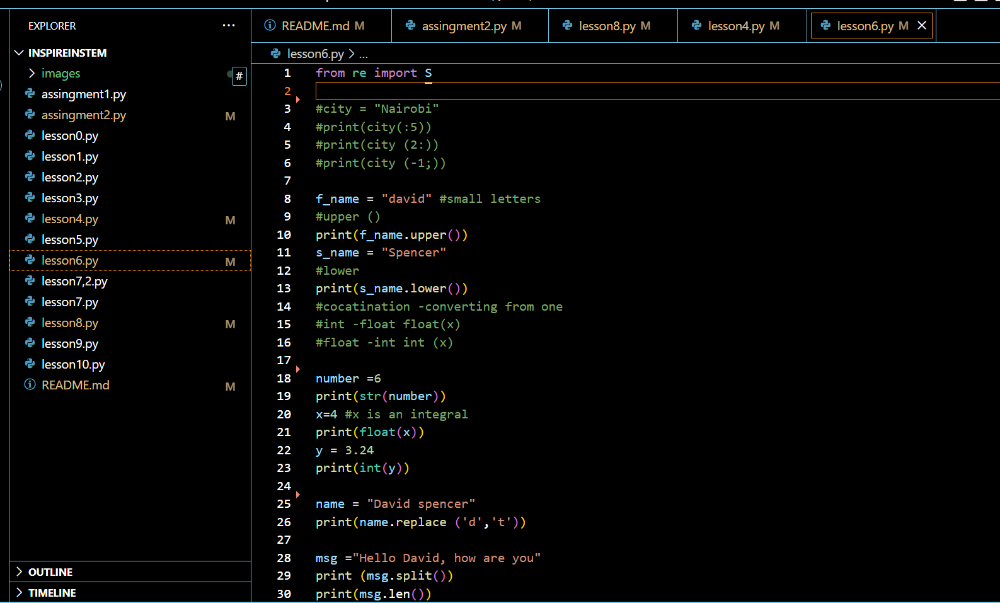
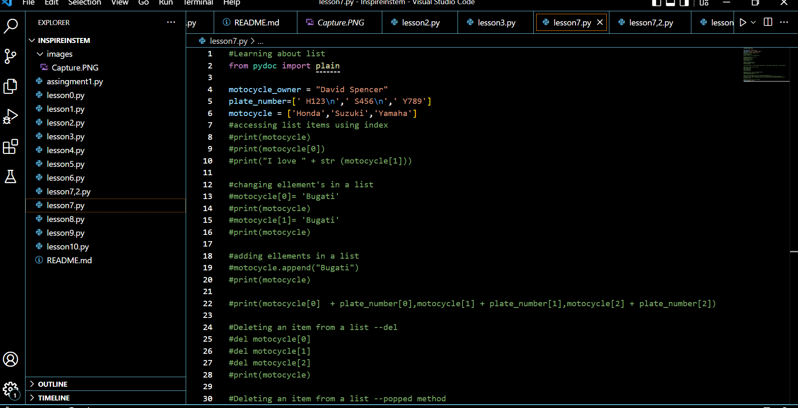
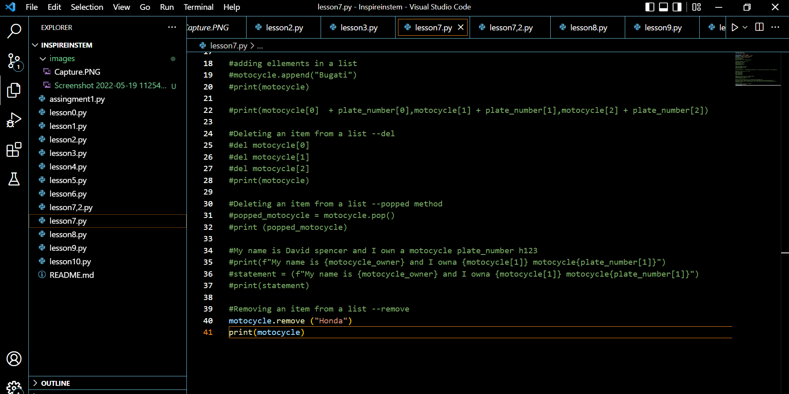
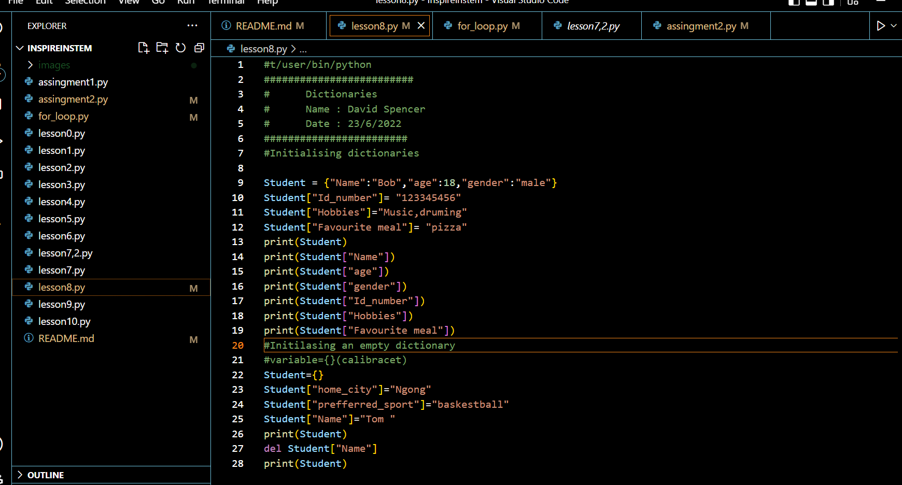
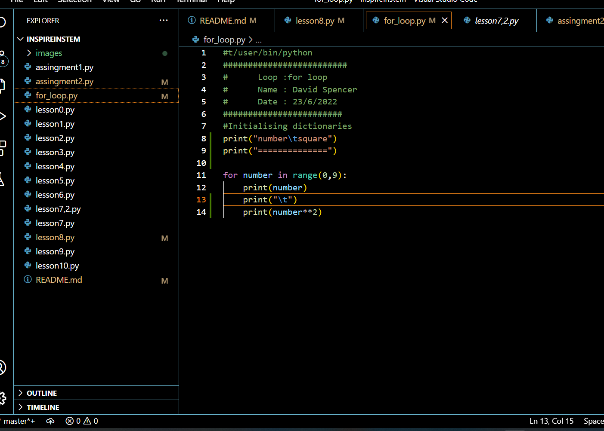

### Inspire youth in stem

## week 1 : introduction to python
Day 1 : Installing python

add link to python downloadhttps://www.google.com/url?sa=t&rct=j&q=&esrc=s&source=web&cd=&cad=rja&uact=8&ved=2ahUKEwiqheee0Oj3AhWKzYUKHRUJBzgQFnoECBMQAQ&url=https%3A%2F%2Fwww.python.org%2Fdownloads%2F&usg=AOvVaw3VuYRIaaa-SL5nRa6pfny0

add link to downloading vs codehttps://www.google.com/url?sa=t&rct=j&q=&esrc=s&source=web&cd=&cad=rja&uact=8&ved=2ahUKEwibvaqt0Oj3AhUmy4UKHWR_A4EQFnoECAoQAQ&url=https%3A%2F%2Fcode.visualstudio.com%2Fdownload&usg=AOvVaw11fc5fOXYIyxQh75jYLjXg

add link toto downloading git for windows
https://www.google.com/url?sa=t&rct=j&q=&esrc=s&source=web&cd=&cad=rja&uact=8&ved=2ahUKEwjXovqJ0Oj3AhXT04UKHX6DBbgQFnoECA0QAQ&url=https%3A%2F%2Fdesktop.github.com%2F&usg=AOvVaw3Q4aArCExy0qKbKQYeMfD4

Day 2:Basic python operations

Using comment 
how to set up a path

Day 3:Variables and data types
Types of data: strings
               integers
Using data types
User input 
Method
using formats
replacing letters 
spliting sentences 
lenng of sentences

Day 4:Learning about lists 
Acessing list using index
Changing ellement's in a list
Adding ellemnt's in a list
Deleting ellemnt's in a list using:
         popped methed
         del method
Removing item from list         

## week 2 : Electronics for inovators
Day 1:initialising dictinaries
      usings loops

## week 3 : Introduction to robotics

## week 4 : Javascript, css, html

## week 5 :